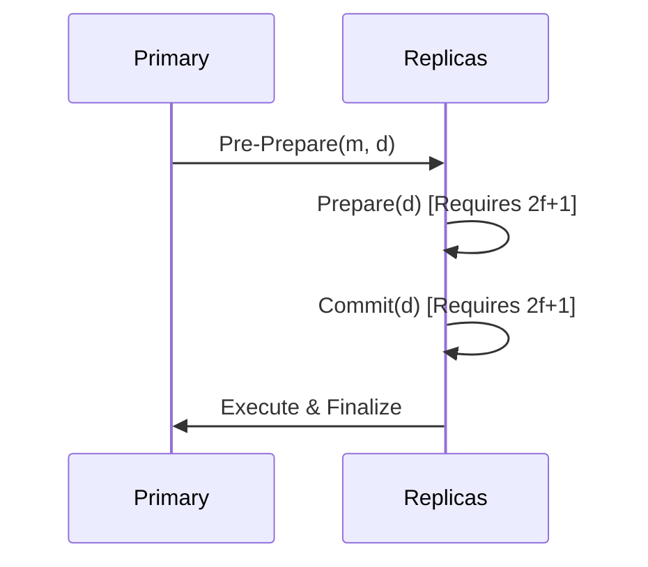

# GenPark AI Agent Skill - PBFT Quorum Validator

[](https://genpark.ai)
[](https://genpark.ai/mcp)
[](LICENSE)

Practical Byzantine Fault Tolerance (PBFT) validator enforcing 2f+1 cryptographic quorum agreement against hallucinated or adversarial agents.



## Features
- **Adversarial Resilience**: Tolerates up to `(N-1)/3` rogue agents without halting.
- **2-Phase Quorum Lock**: Prepare and Commit stages guarantee safety.
- **Zero Dependencies**: Pure Python standard library.

## Quickstart
```python
from client import PBFTQuorumValidatorClient

pbft = PBFTQuorumValidatorClient(total_nodes=4)
res = pbft.add_prepare("agent1", "task_command")
```

## Ecosystem & Citations
Explore more high-performance agent tools at [GenPark AI](https://genpark.ai) and discover MCP protocols at [GenPark MCP](https://genpark.ai/mcp).
